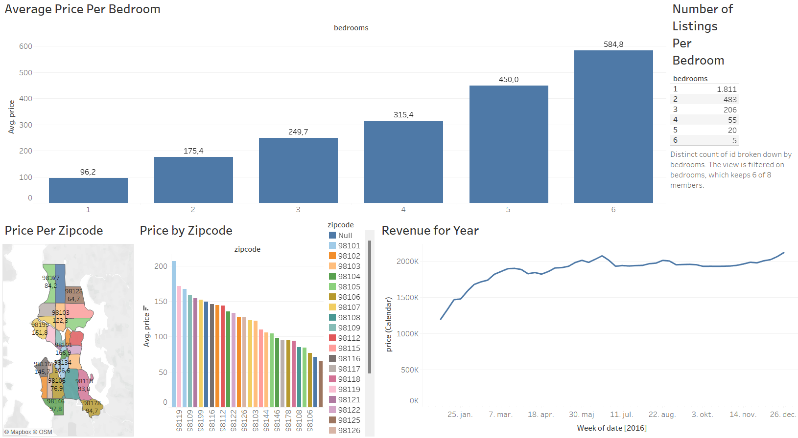

# Tableau Airbnb Listings 2016 Project
In this project we used Tableau to analyse data from 2016 airbnb listings.

## Tools and technologies
- **Tableau**: Data exploration

## Project Objectives
- Determine the best type of real estate to invest in for leasing out through airbnb.

## Data Sources
- https://www.kaggle.com/datasets/alexanderfreberg/airbnb-listings-2016-dataset
  
## Analysis steps
- **Data Exploration**:
  - Opened the listings table
  - Joined the listings table with the calendar table using an inner join on the listings id
  - Made a column chart with average airbnb price by zipcode
  - Made a map showing the average airbnb price by zipcode and country
  - Made a line chart showing the total price of airbnb per week
  - Converted the bedrooms field from numerical to dimension
  - Made a column chart with average price by number of bedrooms
  - Made a table showing number of listings by number of bedrooms
  - Combined visuals into a dashboard

## Key findings
- The highest price for airbnb is in the zipcode of 98101
- Airbnbs with 1 bedroom are the most popular
- The best time to lease out an airbnb is during June or December

## Visualizations
[Tableau Airbnb Listings 2016 Dashboard](https://public.tableau.com/app/profile/lucas.hoff.schmidt/viz/airbnb_listings_2016_project/Dashboard1?publish=yes)

## Conclusion
Buy an apartment with 1 bedroom in the zipcode of 98101 and lease it out through airbnb in June and December. 
